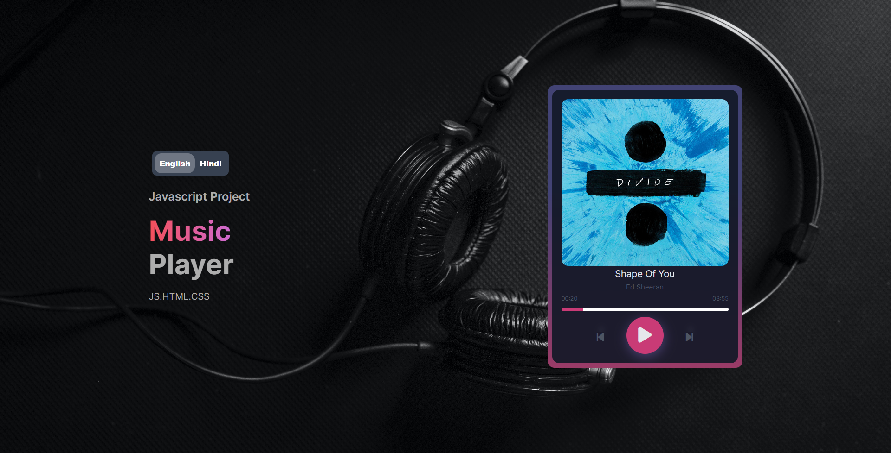

# Music Player - Javascript Project

## Table of contents

- [Overview](#overview)
  - [The challenge](#the-challenge)
  - [Screenshot](#screenshot)
  - [Links](#links)
- [My process](#my-process)
  - [Built with](#built-with)
  - [What I learned](#what-i-learned)
  - [Continued development](#continued-development)
  - [Useful resources](#useful-resources)
- [Author](#author)
- [Acknowledgments](#acknowledgments)

## Overview

### The challenge

Users should be able to:

- Play Pause Music
- Skip to next or previous song
- Go to any part of the music

### Screenshot



### Links

- [Live Site](https://nheroop.github.io/music-player-js/)
- [Source Code](https://github.com/NHeroOP/music-player-js)

## My process

### Built with

- Semantic HTML5 markup
- CSS
- Flexbox
- Javascript

### What I learned

I learnt many things, so some of the highlights are down below


```css
.some-element {
  background: linear-gradient(0deg, rgba(154,59,103,1) 0%, rgba(66,67,116,1) 62%);
}
```
```js
  const width = this.clientWidth;
  const clickX = e.offsetX
  const duration = audio.duration 

  audio.currentTime = (clickX / width) * duration;
```


### Continued development

I will continue to update this site and make it fully working music site using frameworks because vanilla js after learning those frameworks


### Useful resources

- [W3 Schools](https://www.w3schools.com/) - This helped me for many things that i didn't knew
- [CSS Gradient](https://cssgradient.io/) - This helped for creating gradients

## Author 
- NHero

## Acknowledgments

The design of website I got from the web & some things I learned from Youtube
